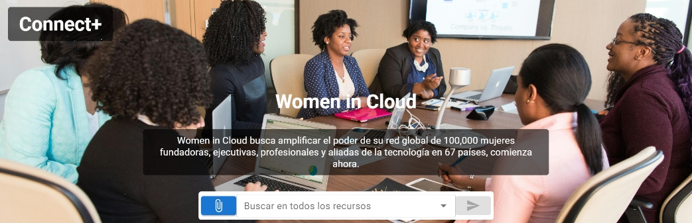
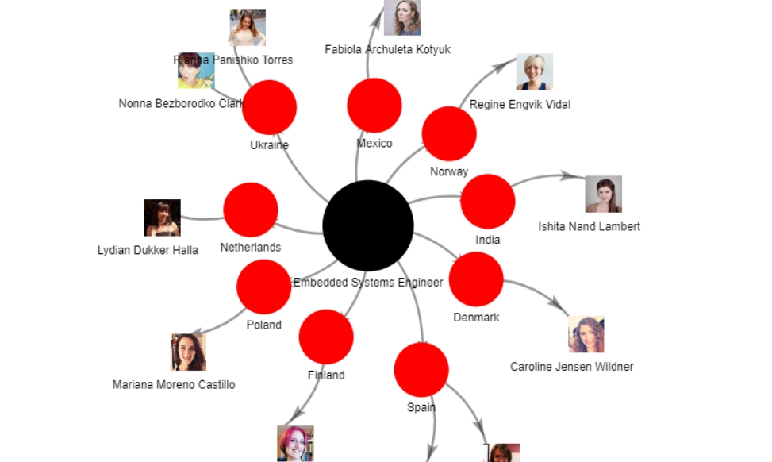

Este fue un proyecto desarrollado como parte de la solución entregada en la Hackathon AI Innovation Challenge organizado por Microsoft, donde se logró alcanzar el segundo lugar de la competición.

# Connect+

**Connect+** es una innovadora plataforma web diseñada para extender la conexión de mujeres a nivel global en el área tecnológica, donde se busca empoderar a las mujeres en el ámbito tecnológico mediante la creación de una comunidad global de apoyo y crecimiento mutuo. Creemos que al facilitar el acceso a redes de contactos, podemos contribuir a reducir la brecha de género en el sector tecnológico y fomentar un entorno más diverso e inclusivo.

## Descripción

En un mundo donde la tecnología es el motor del progreso, Connect+ se posiciona como un puente crucial para las mujeres que buscan adentrarse, crecer y prosperar en este sector. Nuestra plataforma ofrece un espacio inclusivo y dinámico donde las mujeres pueden:

### Conectar

- Establecer redes con profesionales, mentoras y colegas en el campo tecnológico a nivel global.

## Únete a Connect+

Si eres una mujer apasionada por la tecnología y deseas formar parte de una comunidad que te apoye y motive, Connect+ es el lugar perfecto para ti. Únete a nosotras y sé parte del cambio que deseas ver en el mundo tecnológico.

